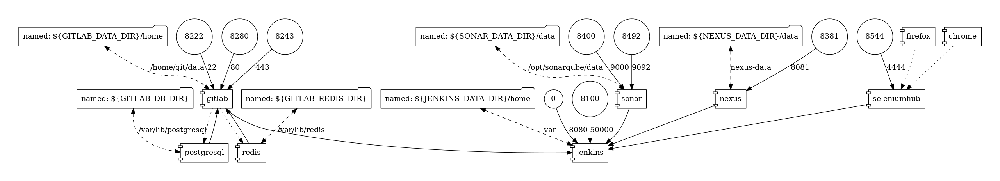

# Your Build Toolbox for Continuous Integration in Docker

[](https://travis-ci.org/holisticon/buildbox)

## Requirements

* Unix OS (Linux and macOS) or  Windows with cygwin
* Docker (6 GB+ assigned)


## Usage



* Build the images: `./docker-build.sh`
* Start the images: `./docker-run.sh`. All data of the containers is stored in the folder `data`.
* Service available:
  * [Jenkins](http://localhost:8180) admin/admin
  * [Gitlab](http://localhost:8280) root/password
  * [Nexus](http://localhost:8381) admin/admin123
  * [Sonar](http://localhost:8400) admin/admin
  * [Selenium Grid](http://localhost:8544/grid/console)

## Advanced

### Update dependency graph

```
docker run --rm -it --name dcv -v $(pwd):/input pmsipilot/docker-compose-viz render -m image docker-compose.yml &&\
  mv docker-compose.png docs/images/
```
